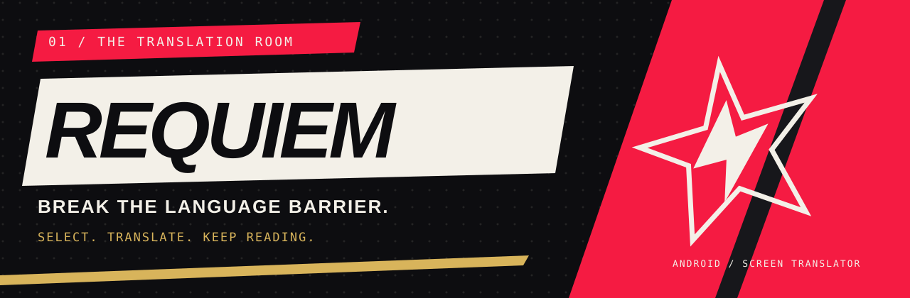
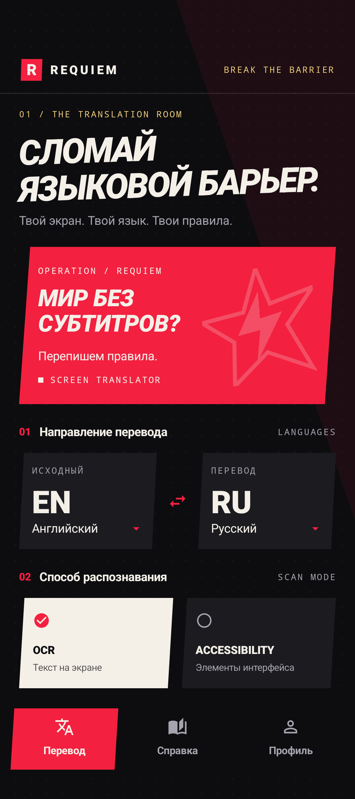
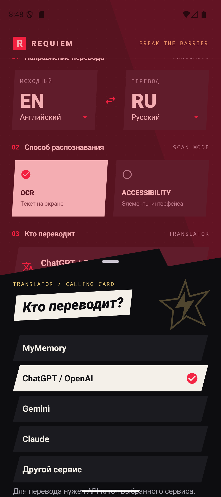
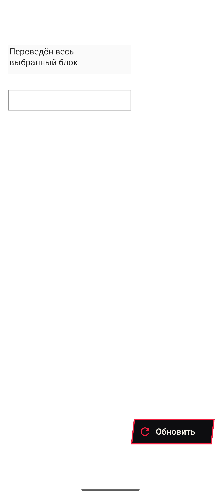
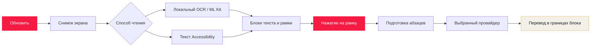
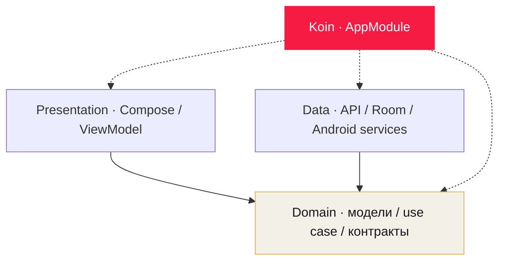

<p align="center">
  
</p>

<p align="center">
  <a href="https://github.com/ddeeaaddllyy/Requiem-Project/actions/workflows/ci.yml"></a>
  
  
  
  <a href="LICENSE"></a>
</p>

<p align="center">
  <strong>Твой экран. Твой язык. Твои правила.</strong><br>
  Перевод выбранного текста поверх Android-приложений — с интерфейсом, вдохновлённым Persona 5 Royal.
</p>

<p align="center">
  <a href="https://github.com/ddeeaaddllyy/Requiem-Project/releases">Скачать</a> ·
  <a href="#как-пользоваться">Быстрый старт</a> ·
  <a href="#провайдеры-перевода">Провайдеры</a> ·
  <a href="#архитектура">Архитектура</a> ·
  <a href="https://github.com/ddeeaaddllyy/Requiem-Project/issues">Сообщить об ошибке</a>
</p>

---

## Что такое Requiem

**Requiem** распознаёт текст на экране, обводит найденные блоки и переводит тот, на который ты нажмёшь. Можно читать диалог в игре, страницу в браузере или интерфейс другого приложения, оставаясь на том же экране.

Распознавание работает по снимку: результат остаётся на месте, пока ты читаешь. Перешёл на другую страницу или прокрутил текст — нажми **«Обновить»**, чтобы получить новые рамки. До выбора блока запрос к переводчику не отправляется.

Красный, чёрный, бумажный белый и золото; угловатые карточки и выразительная типографика. Основной интерфейс продолжает визуальное направление Persona 5 Royal. Поверх исходного текста перевод выглядит спокойно: светлый фон, обычный тёмный текст и прокрутка внутри границ блока.

## Интерфейс

<table>
  <tr>
    <td align="center"><strong>Translation room</strong></td>
    <td align="center"><strong>Calling card / провайдеры</strong></td>
    <td align="center"><strong>Перевод поверх экрана</strong></td>
  </tr>
  <tr>
    <td align="center"></td>
    <td align="center"></td>
    <td align="center"></td>
  </tr>
</table>

<sub>Экран наложения показан на тестовом тексте. Скриншоты отражают разные состояния интерфейса.</sub>

## Возможности

| Область | Что делает приложение |
| --- | --- |
| Выбор текста | Распознаёт блоки и переводит каждый по нажатию на его рамку |
| Стабильное чтение | Сохраняет текущие рамки и результаты до ручного обновления |
| OCR | Читает исходный цветной снимок в его разрешении через Google ML Kit |
| Accessibility | Получает текст и координаты из доступных элементов интерфейса |
| Контекст | Объединяет переносы строк внутри абзаца перед отправкой переводчику |
| Отображение | Показывает перевод в границах выбранного блока; длинный текст прокручивается |
| Провайдеры | MyMemory, ChatGPT / OpenAI, Gemini, Claude и совместимые API |
| Настройки | Сохраняет языки, способ распознавания и выбранного переводчика |
| Профиль | Хранит локальный аккаунт и восстанавливает активную сессию при запуске |
| Управление | Позволяет приостановить захват или остановить его через уведомление |

## Как пользоваться

1. Установи APK из [GitHub Releases](https://github.com/ddeeaaddllyy/Requiem-Project/releases). Если релиз ещё не опубликован, собери приложение по инструкции ниже или скачай `requiem-debug` из успешного запуска [Android CI](https://github.com/ddeeaaddllyy/Requiem-Project/actions/workflows/ci.yml).
2. Открой Requiem, выбери исходный язык, язык перевода и способ распознавания. Переводом можно пользоваться в гостевом режиме.
3. В разделе **«Кто переводит»** выбери сервис. MyMemory готов к работе без ключа; для AI-провайдера сохрани свой API-ключ и название модели.
4. Разреши отображение поверх других приложений и подтверди системный запрос захвата экрана. Для режима Accessibility дополнительно включи сервис Requiem в настройках специальных возможностей.
5. Запусти захват, открой нужное приложение и нажми плавающую кнопку **«Обновить»**.
6. Нажми на рамку нужного текста. Перевод появится внутри неё; длинный результат можно прокручивать.
7. После изменения исходного экрана нажми **«Обновить»** снова. Завершить захват можно через уведомление Requiem.

> [!TIP]
> Сменил язык или провайдера во время захвата? Нажми **«Обновить»**, чтобы новые настройки применились к следующему снимку.

## Провайдеры перевода

| Провайдер | Протокол | Что указать в приложении |
| --- | --- | --- |
| **MyMemory** | MyMemory Translation API | Ключ не нужен |
| **ChatGPT / OpenAI** | Responses API | API-ключ OpenAI и ID модели |
| **Gemini** | `generateContent` | API-ключ Gemini и ID модели |
| **Claude** | Messages API | API-ключ Anthropic и ID модели |
| **Другой сервис** | OpenAI-совместимый Chat Completions | API-ключ, ID модели и базовый HTTPS URL |

Для своего сервиса указывай базовый адрес, например `https://example.com/v1`: приложение добавляет `/chat/completions` самостоятельно. Совместимость требуется именно с форматом Chat Completions и авторизацией Bearer.

Настройки каждого провайдера сохраняются отдельно. Пустое поле ключа при редактировании сохраняет прежний ключ; удалить его можно отдельной кнопкой. Ошибки авторизации, лимитов и недоступной модели отображаются в рамке перевода. Повторное нажатие позволяет повторить запрос.

Приложение использует выбранного переводчика и не переключается на другой сервис при ошибке. Доступность моделей, стоимость и квоты зависят от твоего API-аккаунта. Для ChatGPT / OpenAI нужен API-ключ платформы OpenAI.

## Как проходит перевод



При обновлении старые результаты очищаются, а незавершённые переводы отменяются. Во время снимка собственные наложения скрываются, чтобы распознавание не захватывало уже показанный перевод. До следующего обновления приложение работает с тем же набором блоков.

## Данные и приватность

| Данные | Где обрабатываются или хранятся |
| --- | --- |
| Снимок экрана | В памяти устройства; OCR выполняется локально |
| Выбранный текст | Отправляется выбранному провайдеру вместе с языками и инструкциями перевода |
| API-ключи | AES-GCM, ключ шифрования в Android Keystore; файлы в `noBackupFilesDir` |
| Настройки и активная сессия | Локальные SharedPreferences |
| Аккаунт | Локальная Room-база устройства |

Скриншот не отправляется API перевода. Ключи не встраиваются в APK, не сохраняются в состоянии интерфейса и исключены из Android backup. Правила обработки отправленного текста определяет выбранный сервис.

Профили в текущей версии локальные: выход завершает сессию, но сохраняет аккаунт для следующего входа. Серверная авторизация через [nedovolen-server](https://github.com/ddeeaaddllyy/nedovolen-server) пока не подключена.

## Архитектура

Один Android-модуль `:app`, разделённый на `presentation`, `domain` и `data`. ViewModel управляют состоянием экранов, use case описывают действия, а адаптеры работают с Android, базой и внешними API. Koin связывает реализации с интерфейсами.



| Компонент | Ответственность |
| --- | --- |
| `ScreenCaptureService` | Жизненный цикл захвата, снимки по запросу и отмена текущих операций |
| `SelectTextForTranslationUseCase` | Выбор блока и состояния распознавания / загрузки / результата / ошибки |
| `ProviderTranslator` | Маршрутизация к выбранному провайдеру |
| `MyMemoryTranslator` / `AiTranslator` | Подготовка запросов и разбор ответов API |
| `OverlayManager` | Рамки, перевод и плавающая кнопка обновления |
| `EncryptedProviderConfigurationRepository` | Зашифрованное хранение конфигураций провайдеров |

## Технологии

| Задача | Решение |
| --- | --- |
| Язык | Kotlin 2.0.0, JVM target 17 |
| UI | Jetpack Compose, Material 3, собственные формы в духе Persona 5 Royal |
| Состояние и асинхронность | ViewModel, StateFlow, Kotlin Coroutines |
| Dependency injection | Koin 4.0.4 |
| Локальная база | Room 2.6.1, KSP |
| Сеть | Retrofit 2.9.0, OkHttp, Gson |
| Распознавание | Google ML Kit Text Recognition |
| Захват и наложение | MediaProjection, foreground service, WindowManager, AccessibilityService |
| Тесты | JUnit, AndroidX Test, Compose UI Test |
| Сборка и доставка | Gradle Wrapper, GitHub Actions, подписанные APK / AAB |

## Сборка из исходников

Понадобятся **JDK 17**, Android SDK с **API 36** и **Build Tools 36.0.0**. Устройство или эмулятор — **Android 12 / API 31** и новее.

```sh
git clone https://github.com/ddeeaaddllyy/Requiem-Project.git
cd Requiem-Project
```

Открой корень проекта в Android Studio и дождись Gradle Sync. IDE запишет путь к SDK в локальный `local.properties`; API-ключи вводятся в приложении.

**Windows / PowerShell:**

```powershell
.\gradlew.bat :app:assembleDebug
.\gradlew.bat :app:installDebug
```

**Linux / macOS:**

```sh
bash ./gradlew :app:assembleDebug
bash ./gradlew :app:installDebug
```

`installDebug` требует подключённого устройства или запущенного эмулятора. Готовый APK: `app/build/outputs/apk/debug/app-debug.apk`.

## Структура репозитория

```text
Requiem-Project/
├── app/
│   ├── src/main/java/com/application/requiemproject/
│   │   ├── data/           # API, переводчики, Room, repositories, Android services
│   │   ├── domain/         # Модели, контракты и use case
│   │   ├── presentation/   # Compose-экраны, ViewModel, navigation и overlay
│   │   └── di/             # Граф зависимостей Koin
│   ├── src/main/res/       # Ресурсы и конфигурация Android
│   ├── src/test/           # JVM-тесты
│   ├── src/androidTest/    # Тесты на устройстве
│   └── docs/screenshots/   # Скриншоты интерфейса
├── docs/assets/            # Оформление README
├── gradle/                 # Wrapper и каталог зависимостей
└── .github/                # CI, release и инструкции по подписи
```

## Проверки и релизы

```powershell
# Локальные тесты и Android lint
.\gradlew.bat :app:testDebugUnitTest :app:lintDebug

# Тесты на подключённом устройстве или эмуляторе
.\gradlew.bat :app:connectedDebugAndroidTest
```

На Linux / macOS используй `bash ./gradlew` вместо `.\gradlew.bat`. Тесты покрывают выборочное распознавание и перевод, ответы API, настройки провайдеров, хранение ключей, восстановление аккаунта, навигацию и наложения.

| Workflow | Когда запускается | Результат |
| --- | --- | --- |
| [Android CI](.github/workflows/ci.yml) | Push в ветки, pull request, ручной запуск и вызов из release | Debug APK, JVM-тесты, lint, тесты на Android 36 и отчёты |
| [Android Release](.github/workflows/release.yml) | Тег `v*` или ручной запуск с существующим тегом | После CI: подписанные APK, AAB и `SHA256SUMS.txt` в GitHub Releases |

Настройка signing secrets и публикация описаны в [инструкции по релизам](.github/RELEASE.md). Автоматическая публикация в Google Play не настроена.

## Текущие ограничения

- OCR использует модель **Latin**. Наличие русского или японского в списке языков перевода не означает поддержку их распознавания этим OCR. Accessibility может получить такой текст, если приложение предоставляет его в дереве интерфейса.
- После прокрутки или перехода на другой экран нужно обновить снимок вручную. Рамки относятся к последнему распознанному экрану.
- Защищённые от захвата окна могут быть недоступны для OCR; Accessibility зависит от того, какие данные предоставляет исходное приложение.
- Для перевода через внешний сервис нужен интернет. Качество зависит от распознанного текста, выбранного провайдера и модели.
- Облачная синхронизация аккаунта и история переводов пока не реализованы.

## Участие в разработке

Нашёл ошибку? Создай [issue](https://github.com/ddeeaaddllyy/Requiem-Project/issues) с версией Android, способом распознавания, провайдером и шагами воспроизведения. Для проблем перевода приложи исходный текст и результат; ключи и личные данные из примера убери.

В pull request опиши поведение до и после изменения и выполненные проверки. Для изменений интерфейса приложи скриншоты и сохраняй визуальное направление Persona 5 Royal, читаемость и доступность. Правила Android-модуля — в [app/AGENTS.md](app/AGENTS.md).

## Лицензия и автор

Код распространяется под [Apache License 2.0](LICENSE). Визуальное направление вдохновлено **Persona 5 Royal**; Requiem — независимый проект, не связанный с Atlus или Sega.

Создан [@ddeeaaddllyy](https://github.com/ddeeaaddllyy).

<p align="center"><strong>SELECT. TRANSLATE. KEEP READING.</strong></p>
